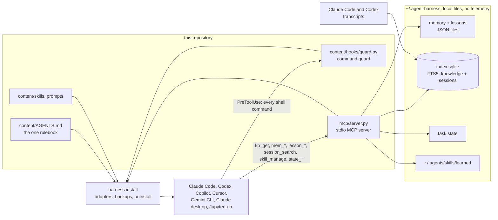

# agent-harness

**One standard-library install that gives seven AI coding tools the same rules, memory, retrieval, lessons and command guard.**

Implemented with AI coding agents under Oscar's design and review. The learning loop (`session_search`,
`skill_manage`, the memory snapshot arm) follows the design of Hermes Agent; skills use the agentskills.io
format; the tools talk to the harness over the Model Context Protocol.

## The problem

AI coding tools such as Claude Code, Codex, GitHub Copilot, Cursor and Gemini CLI are only as good as the
instructions and context they are given. Out of the box each one has its own instruction file, its own
settings, and no memory shared with the others. They forget everything between sessions, re-read whole
files, stop to ask about trivial things, claim work is done without checking it, and repeat the same
mistakes. Setting up seven tools by hand, and keeping them consistent, is tedious and rarely kept up.

agent-harness installs one set of working rules, one shared memory, a searchable knowledge base, a
safety guard and a few skills into every tool it finds, in each tool's own format, with a backup and
an uninstall. The goals, and what has been measured for each (see Results):

- **fewer tokens:** agents fetch only the section of a document they need, not the whole thing. Measured
  mixed: Codex with the harness used 0.82x the tokens of plain in the v0.1.1 eval, Claude 1.24x.
- **quality:** agents define "done" as a check, run it, and show the evidence. The check arms could not show a gain.
- **memory that lasts:** preferences, facts and work in progress survive new sessions and compaction.
- **self-learning:** a lesson after a real failure, a skill for a procedure that took several tool calls to find.
- **past conversations, searchable:** "what did we decide last week?" is answered from your own local Claude
  Code and Codex transcripts, secrets masked. Recall of an earlier session went from 0/3 to 3/3.
- **a safety net:** a guard blocks catastrophic shell commands (deleting your home folder, wiping disks,
  `sudo`, piping unknown scripts into a shell, force-pushing to `main`, reading SSH keys).

## Approach (methods and algorithms)

- **One source of truth, many adapters.** `content/AGENTS.md` is the only rulebook (under 120 lines, because
  it is paid for in every request). An adapter per tool copies or merges it to where that tool reads its
  instructions, registers the MCP server and the guard hook, and records what it wrote so `harness
  uninstall` restores every file from its backup.
- **Partial retrieval.** Documents are split into sections at their headings and indexed in SQLite FTS5
  with BM25 ranking (a pure-Python fallback exists). The rules carry a compact index of section ids; the agent
  calls `kb_get(id)` for one section, and `kb_search(query)` only when nothing in the index fits. Results carry
  their size in bytes so the agent can budget.
- **Memory, lessons, task state.** Small human-readable JSON files in `~/.agent-harness`, one store per
  machine shared by every tool. Near-duplicates are merged, caps archive the least used rather than delete.
  `state_save` / `state_load` carry unfinished work across a compaction.
- **Past conversations.** `session_search` indexes the user's own Claude Code and Codex transcripts
  incrementally (only what was appended), user and assistant messages only, secrets masked before storage,
  capped at 64 MB.
- **Skills learned from experience.** `skill_manage` saves a procedure as `SKILL.md`, refuses near-duplicates,
  and archives the least used beyond 40.
- **The guard** (`content/hooks/guard.py`) analyses a command rather than pattern-matching its text: it
  tokenises like a shell, splits pipelines, unwraps `env`/`nice`/`timeout`/`xargs`, follows `bash -c`, `eval`,
  `$(...)`, backticks and heredocs that feed a shell, classifies each target path (root, home, a
  top-level home folder, a variable that may be empty, `..`), and fails closed on a payload it cannot parse.
  Standard library only, no subprocesses.
- **Ship by a pre-set keep rule.** A feature ships only if it passes a rule written before the eval (accuracy
  no worse, a measurable gain, token overhead within +15%); parts that fail stay off by default. See `eval/`.

## Results

### The A/B eval (historical, private corpus)

**Measured on a private corpus, 2026; question set not published.** Source: the v0.2 eval, dated 2026-09-30,
**254 runs** (Claude Code and Codex, one run per question and condition); transcribed in
[eval/results/historical.md](eval/results/historical.md). 20 questions, regex graders. "plain" is the tool
without the harness; the Codex plain column still carries the rules text.

| | plain | v0.1.1 | v0.2.0 |
|---|---|---|---|
| Claude, 20 questions correct | 17/20 | 18/20 | 19/20 |
| Codex, 20 questions correct | 17/20 | 18/20 | 19/20 |
| Recall of an earlier session (3 questions), Claude | 0/3 | 1/3 | 3/3 |
| Recall of an earlier session (3 questions), Codex | 0/3 | 0/3 | 3/3 |
| Claude fixed context per request, tokens | 17,365 | 37,173 | 37,668 |
| Codex fixed context per request, tokens | 15,054 | 15,054 | 15,134 |

- The harness's own share of Claude's fixed context per request grew **+2.5%** from v0.1.1 to v0.2.0. Most of the
  gap to plain is the author's other plugins, not the harness: the harness rules alone were measured at 2,291
  tokens per request in the v0.1.1 eval.
- **The skills gain is indistinguishable from noise at n=3.** Codex created a skill in 3/3 first runs and read
  it in 3/3 second runs; Claude created none unprompted, and its second-run token counts spread from 0.56x to
  1.91x with no skill involved.
- The two arms (`memory_snapshot`, `skill_nudge`) showed no gain and ship off.
- **v0.1.1 coding tasks: 12/12 correct in every arm, with 0 tampered tests and 0 false "done" claims in each**
  (36 coding runs, part of the 190-run batch). The check arms (`run_checks`, `check_guard`) could not
  show a gain because the control never failed; they ship off.
- Differences of one or two answers on 20 questions are inside the noise: the v0.2 pass ran each question once.

### The same eval, on a public synthetic set

No results yet. [eval/](eval/) holds the runner, the report generator and a public SYNTHETIC question set
(20 questions over a made-up documentation corpus, same structure: retrieval, a cross-session recall probe,
repeated procedures, memory, coding tasks). Running it spends Claude Code and Codex usage, so it was not run
here; the commands are in [eval/README.md](eval/README.md), and `python3 eval/runner.py grade-selftest` and
`python3 -m pytest -q eval` check the instrument for free.

### The guard against a wider corpus

The guard's tests were extended with a representative set of dangerous and safe commands taken from the
author's private shell-hook test suite (352 cases extracted, paths made neutral):
[tests/test_guard_cases.py](tests/test_guard_cases.py). The comparison found 105 cases where the harness guard
and that suite disagreed. **24 were gaps and are fixed** (`rm${IFS}-rf${IFS}/`, `rm -rf ${HOME:?}`,
`bash -lc "rm -rf ~"`, `echo 'rm -rf ~' | bash`, `rsync --delete` into home, `mv ~/Documents away`, an
absolute `/home/user/Documents`, `dd of=/etc/hosts`, a non-string command in the hook payload, and more).
The other 81 are recorded, not fixed:

| remaining disagreements | cases | verdict |
|---|---|---|
| the author's own machine policy: network and VPN control, macOS system tools, the author's own agent settings | 39 | out of scope for a catastrophic-command guard |
| the harness is stricter (all `sudo`, SSH key flags, `find ..`, text that looks like a fork bomb) | 14 | by design; the fork-bomb text in a quoted note is a known false positive |
| open gaps: targets computed by `$(...)`, inline code in another interpreter, login-script and cron persistence, `find \| xargs` | 18 | pinned as expected failures in the tests; the guard is a seat belt, not a sandbox |
| the private suite asks about single files and project paths the harness allows (`rm ~/Desktop/note.txt`) | 9 | by design |
| an empty `{}` payload | 1 | cannot be told from a non-shell tool |

Source of the counts: a one-off comparison against the author's private test file (not in this repository);
the cases themselves are in `tests/test_guard_cases.py`. Test counts: `scripts/check.sh` prints them.

## How to run

You need Python 3.9 or newer (already on macOS and most Linux machines). Nothing else is required: the
harness uses only Python's standard library and takes under 20 MB.

```sh
git clone https://github.com/hihihhi/agent-harness.git && python3 agent-harness/bin/harness install --dry-run
```

`--dry-run` shows exactly which files would change for each tool you have and writes nothing. Drop it to
install: the installer asks before touching anything, and every file it changes is backed up first. Then
restart your AI tool and run `python3 agent-harness/bin/harness doctor`.

Check the repository (tests, secret scan, and a demo that installs into a throwaway home, never yours):

```sh
bash scripts/check.sh          # needs pytest; prints CHECK: PASS and exits 0 only if everything passed
python3 content/hooks/guard.py --check "rm -rf ~"     # the guard by hand: exits 2 with the reason
```

| command | what it does |
|---|---|
| `harness install --dry-run` | show the plan, change nothing |
| `harness install --tools claude-code,codex` | only these tools |
| `harness install --project .` | set up only the current project, not your whole user account |
| `harness install --profile DIR` | add facts about your machine or team (see `profiles/example/`) |
| `harness warmup` | build the search index and add optional plugins (web fetch, browser) |
| `harness status` / `harness doctor` | what is installed, and is it healthy |
| `harness learn` | show the lessons your agents have learned |
| `harness update` | refresh the rules and skills; memory and lessons are kept |
| `harness uninstall` | put everything back as it was |

(`harness` is `python3 agent-harness/bin/harness`.) To undo: `harness uninstall` restores every file the
installer changed from its backup and removes what it added. Your memory and lessons stay in
`~/.agent-harness`; delete that folder yourself if you want them gone too.

To run the A/B eval yourself, see [eval/README.md](eval/README.md). The continuous-integration workflow
(`.github/workflows/ci.yml`) runs the tests and `scripts/secret-scan.sh`; it has not run on GitHub yet.

## Architecture



| path | role |
|---|---|
| `src/agent_harness/cli.py`, `installer.py`, `adapters/` | install, update, uninstall, doctor; one adapter per tool |
| `src/agent_harness/mcp/` | the MCP server: `kb.py` (retrieval), `memory.py`, `state.py`, `sessions.py`, `skills.py`, `checks.py` |
| `content/` | the rules, skills, prompts and hooks that get installed |
| `profiles/example/` | a profile: knowledge paths, extra rules and a machine descriptor, kept outside the repo |
| `eval/` | the A/B eval: runner, report generator, SYNTHETIC questions and corpus |
| `tests/` | the harness's tests, including the guard corpus (`test_guard_cases.py`) |

How each part works, in more depth: [docs/how-it-works.md](docs/how-it-works.md); the build contract:
[CONTRACT.md](CONTRACT.md).

### Supported tools

Each tool is set up in its own app and, where it runs inside VS Code, there too. It works the same on a
laptop and on a remote Linux server reached over SSH: install the harness on the machine where the tool runs.

| tool | standalone | inside VS Code |
|---|---|---|
| Claude Code | terminal `claude`: rules, memory tools, skills, slash prompts, guard hook | the extension reads the same user settings |
| Codex | terminal `codex`: `AGENTS.md`, memory tools, skills | the IDE extension shares the same `~/.codex` configuration |
| GitHub Copilot | (VS Code only) | instructions, prompt files and memory tools in your VS Code user settings |
| Cursor | the Cursor app: rules and memory tools | Cursor is itself a VS Code build, so this is the same install |
| Gemini CLI | terminal `gemini`: `GEMINI.md`, memory tools, skills | Gemini Code Assist's agent mode reads the same `~/.gemini` settings |
| Claude desktop app | memory and knowledge tools | not applicable |
| JupyterLab (Jupyter AI) | rules for notebook assistants | not applicable |
| anything else that reads `AGENTS.md` | the shared rules file | the same |

Skills are installed once in `~/.agents/skills/`, which Codex, Gemini CLI, Cursor and Copilot read; Claude
Code gets a link to the same folder. Cursor reads `.cursor/mcp.json` in every open folder as well as in your
home, so a workspace that opens your home folder itself loads the memory tools twice; open a project
folder instead.

### Privacy

Everything stays on your machine. Memory, lessons, task state and the knowledge index are plain files in
`~/.agent-harness` (override with `HARNESS_HOME`). Nothing is uploaded by the harness and there is no
telemetry. Your AI tool still sends your prompts and the context it reads to its own provider, as before;
the harness reduces how much it reads, but not where it goes. The rules tell agents never to store secrets
in memory, and the guard blocks reading SSH keys, cloud credentials and `.env` files through the shell.
Optional plugins are installed only by `harness warmup`, which shows their size first.

## Limits

- **The results are from a private corpus** and cannot be reproduced from this repository; the public
  synthetic set has not been run yet, so it has no results.
- **Small samples.** One run per question and condition in the v0.2 pass; recall and repeated procedures are
  3 questions each. A difference of one or two answers is inside the noise, so the steps from 17 to 18 to 19
  of 20 should be read that way.
- **Two of the seven tools were measured.** The eval ran Claude Code and Codex. The other adapters are tested
  for the files they write and merge, not for any effect on the agent.
- **Codex "plain" is not plain**: no flag skips its global instructions file, so its plain column still
  carries the rules text.
- **Tokens: mixed.** Claude with the harness carried more fixed context per request than plain (37,668 vs
  17,365, most of it the author's other plugins) and used 1.24x plain's tokens in the v0.1.1 eval.
- **The check arms are off.** `run_checks`, the finish gate and `check_guard` could not show a gain, because
  the control never claimed false "done" or tampered with a test in 12 runs; the bait tasks need to be harder.
- **The guard is a seat belt, not a sandbox.** It stops the common catastrophic mistake an agent makes. 18
  commands from the wider corpus still get through (see Results) and are pinned as expected failures;
  `sudo` is blocked outright.
- **`--home DIR` and `HOME=DIR` differ.** With `--home` the installer skips editor extensions; with the
  environment variable it treats the folder as your real home and installs VS Code extensions into it
  (a download). `scripts/check.sh` uses `--home`.
- **Not run in CI yet.** The workflow file is written; this repository has not been pushed with it.
- Related, not part of this repository: a private task-graph tool (claude-plan-harness) drives work from
  plan files; it is not included.

## What I learned

What the eval reports record as conclusions:

- A pre-set keep rule is worth having: it shipped `session_search` (recall 6/6 against 1/6 and 0/6) and learned
  skills, and kept the two arms off because they showed no gain.
- The skills gain is not distinguishable from noise at n=3: Claude's second runs spread 0.56x to 1.91x with no
  skill involved, and creating a skill costs the first run, so it pays back only from about the third use.
- The harness's overhead is mostly what it puts in every request: the v0.1.0 rules cost 4,925 tokens per
  request, the lean v0.1.1 rules 2,291 (-53%), and Codex went from 1.82x plain's tokens to 0.82x between
  those two versions while Claude's accuracy rose from 17 to 20 of 20.
- Checks that guard against a failure only show a gain when the control fails; Claude did not tamper with or
  falsely claim "done" on any of 12 control runs, so the arms could not be judged.

TODO-OSCAR: in your own words, what you would tell another engineer about building and measuring an agent harness.
