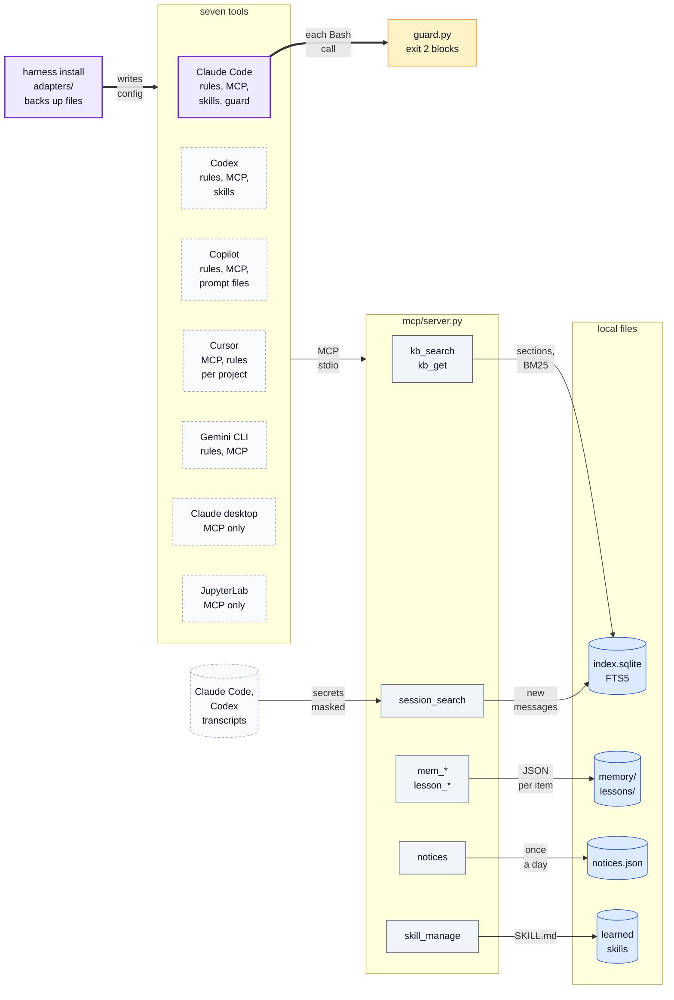
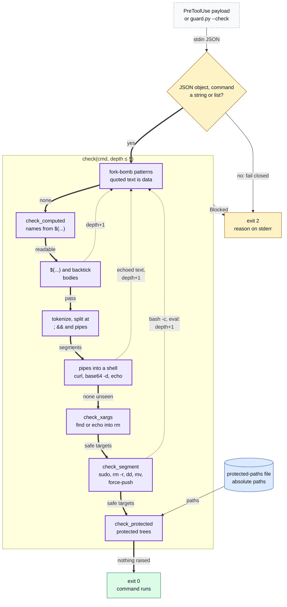

# agent-harness: Shared Rules, Memory, a Work Graph and a Command Guard for AI Coding Agents

[](https://github.com/oscar-chw/agent-harness/actions/workflows/ci.yml) [](https://github.com/oscar-chw/agent-harness/actions/workflows/lint.yml)

One standard-library install that gives Claude Code shared rules, memory, retrieval, lessons and a command guard,
and gives six other AI coding tools the rules, the memory tools or both, as far as each supports them. It is for
anyone who works with several AI coding agents and wants one set of rules and one memory across them, plus a
guard that blocks catastrophic shell commands. In a private-corpus A/B eval (n=3 per tool: suggestive, not
significant), past-session search took recall of an earlier session from 1/3 to 3/3 for Claude and 0/3 to 3/3 for
Codex; on a held-out set, the v0.2 guard blocked 39 of 45 dangerous commands and allowed 20 of 20 safe ones.

[Quick start](#quick-start) · [Docs](docs/README.md) · [All diagrams](docs/DIAGRAMS.md)

What one install writes into each tool, and what the tools then call; only Claude Code gets the guard:



Where in the code: `src/agent_harness/installer.py`, `adapters/*.py`, `mcp/` (`server.py`, `kb.py`, `memory.py`, `sessions.py`, `skills.py`), `content/hooks/guard.py`; stores under `~/.agent-harness`.

## Why this exists

AI coding tools such as Claude Code, Codex, GitHub Copilot, Cursor and Gemini CLI are only as good as the
instructions and context they are given. Each has its own instruction file and settings, and no memory shared
with the others. They forget everything between sessions, re-read whole files, claim work is done without
checking it, and repeat the same mistakes. Setting up seven tools by hand, and keeping them consistent, is
tedious and rarely kept up.

## Approach

- **One source of truth, many adapters.** An adapter per tool writes `content/AGENTS.md` where that tool reads its
  instructions, registers the MCP server (for Claude Code, the guard hook too) and records it for the uninstall.
- **Partial retrieval.** Documents are split into sections at their headings and indexed in SQLite FTS5 with
  BM25. The rules carry a compact index of section ids; the agent fetches one section with `kb_get(id)` and
  calls `kb_search(query)` only when nothing in the index fits.
- **Memory, lessons, task state, learned skills.** Small files in `~/.agent-harness`, one store per machine
  shared by every tool. `skill_manage` saves a working procedure as `SKILL.md`; `state_save` / `state_load`
  carry unfinished work across a compaction.
- **Past conversations.** `session_search` indexes your own Claude Code and Codex transcripts incrementally,
  user and assistant messages only, secrets masked before storage, capped at 64 MB.
- **The guard** analyses a command rather than pattern-matching its text: it tokenises like a shell, unwraps
  `env`, `xargs`, `bash -c`, `eval`, `$(...)` and heredocs, resolves a relative path against an earlier `cd`,
  classifies each target, and fails closed on a payload it cannot parse.
- **The work graph** (v0.3, off by default): one markdown file per goal. A node is done only when its gate
  command exits 0, run by the graph after the guard has passed it; a failed gate returns the node to pending
  with its output, and claims are atomic with a lease, so parallel sessions never take the same node.
- **A keep rule decides what ships on:** accuracy no worse, a measurable gain, token overhead within +15%;
  parts that fail stay off ([the rule and its provenance](docs/design-decisions.md#the-keep-rule)).

How the guard decides one command: every check can raise `Blocked`; only a command that passes all of them runs.



Where in the code: `content/hooks/guard.py` (`verdict_for_payload`, `check`, `check_segment`, `check_protected`); the hook entry is in `src/agent_harness/adapters/claude_code.py`. Every part in depth: [docs/how-it-works.md](docs/how-it-works.md).

## Results

Each row keeps its qualifier; the full numbers and caveats are in [docs/results.md](docs/results.md).

| What | Result | Scope and evidence |
|---|---|---|
| Recall of an earlier session, v0.1.1 → v0.2.0 | **Claude 1/3 → 3/3, Codex 0/3 → 3/3** | **private corpus**, one run per question, **n=3** per tool; not significant per tool (Fisher p = 0.40, 0.10). [historical.md](eval/results/historical.md) |
| Accuracy, 20 questions: plain / v0.1.1 / v0.2.0 | 17 / 18 / 19 of 20, both tools | private corpus, one run each: a 1–2 answer difference is noise. Plain ran in `--safe-mode`, so it is a floor. [historical.md](eval/results/historical.md) |
| What the harness adds to each Claude request | **~2,450 tokens, an upper bound** | most of the 17k → 37k gap in the eval came from the author's other plugins; Claude used 1.24x plain's tokens in the v0.1.1 eval. [test_context_budget.py](tests/test_context_budget.py) |
| Guard, held out (v0.2) | **39/45 dangerous blocked (87%), 20/20 safe allowed** | the held-out claim; the set was written by the same build session that fixed the guard. [test_guard_heldout.py](tests/test_guard_heldout.py) |
| Guard on agentic-os's corpus (v0.3) | **150/231 blocked, held out** | 221/221, and 183/186 on this repo's own corpus, only after fixing with both sets in view. [test_guard_cross.py](tests/test_guard_cross.py) |
| Work graph (v0.3) | 181 of 203 real nodes gated | the author's own use, **not an A/B eval**; the `plan` tool ships **on** since v0.3.3 by the owner's decision (`HARNESS_DISABLE=plan` turns it off). [tests/workgraph](tests/workgraph) |
| Public synthetic eval | **no results** | the one attempt failed at the CLI's login: 6 runs, 0 tokens; no rerun planned. [record](eval/results/public-synthetic-2026-10-03-claude-opus-5-1m-not-run.json) |
| Test suite, Python 3.9 (v0.3.2) | 836 passed, 2 skipped, 2 expected failures | `python3 -m pytest -q tests eval`; CI runs 3.9 and 3.12. [tests/](tests/) |

## Quick start

```sh
# Python 3.9+, nothing else
git clone https://github.com/oscar-chw/agent-harness.git && cd agent-harness
python3 bin/harness install --dry-run   # every file it would change, for each tool you have; writes nothing
bash scripts/demo.sh                    # install, doctor and the guard in a throwaway home: DEMO: PASS
python3 content/hooks/guard.py --check "rm -rf ~"   # blocked, with the reason; exit 2
python3 bin/harness install             # the real install: asks per tool, backs up every file first
python3 bin/harness uninstall           # restores every backed-up file
python3 bin/harness status --matrix     # which tool gets which feature (review, run, discover, improve, ...)
```

A real install (without `--dry-run`) **replaces `~/.claude/CLAUDE.md`** and the other tools' instruction files
with the harness rules, and merges into their settings. Every file is backed up first, and `harness uninstall`
restores them all. Every command, the demo's output and the checks: [docs/usage.md](docs/usage.md).

## Project structure

```
bin/harness          the CLI launcher (install, update, uninstall, status, doctor)
src/agent_harness/   installer, one adapter per tool, the MCP server, the work graph
content/             what gets installed: the rules (AGENTS.md), skills, prompts, hooks (guard.py)
profiles/example/    an example deployment profile
eval/                the A/B eval: runner, report, SYNTHETIC questions and corpus, results
tests/               the tests, the guard corpus, the held-out guard set, the work-graph suites
scripts/             check.sh (tests, secret scan, demo), demo.sh, secret-scan.sh
docs/                how it works, results, design decisions, usage, diagrams
```

Docs: see [docs/README.md](docs/README.md).

### Design decisions and trade-offs

- **Standard library only**, so it installs wherever an AI tool runs, including over SSH; the cost is a
  pure-Python BM25 fallback and hand-written frontmatter and TOML handling.
- **A guard that fails closed,** and judges the work graph's gates too: a false block can be asked about, a
  missed `rm -rf ~` cannot be undone; the cost is false positives such as all `sudo`.
- **One rules file for every tool**, capped at 60 lines by a test because it is paid for in every request.

Each with its cost in full, the keep rule and the setups this replaced: [docs/design-decisions.md](docs/design-decisions.md).

## Limits

- **Private corpus, small n, confounded baseline.** The A/B results cannot be reproduced from this repository,
  and recall rests on 3 questions with one run each. Plain ran in `--safe-mode`, the harness columns with the
  author's full account setup, so only v0.1.1 against v0.2.0 isolates the harness; there is no comparison with
  Claude Code's own `CLAUDE.md` memory, `--resume`, or a grep over past transcripts.
- **Two of the seven tools were measured;** the other adapters are tested for the files they write only.
- **The guard is a seat belt, not a sandbox.** Two gaps stay open: a glob after `cd` into a folder named by a
  variable (`cd $DIR && rm -rf *` is judged as written), and a relative target in a `--check` call, which has
  no working directory to resolve it against (a real hook payload does). `sudo` is blocked outright.
- **The work graph has no A/B eval.** Its evidence is the author's own use and an adversarial certification,
  not a gain measured against plain. It ships on anyway (v0.3.3, the owner's decision): it is what keeps the goal and
  each step's check on disk through context loss. `HARNESS_DISABLE=plan` turns it off.
- **`--home DIR` and `HOME=DIR` differ:** only `HOME=DIR` installs VS Code extensions (a download) into the folder.
- **Packaging was checked offline only,** and needs setuptools>=61 ([details](docs/usage.md#install-caveats)).

## What I learned

Each lesson is drawn from a conclusion an eval record states ([where they come from](docs/results.md#where-the-readmes-lessons-come-from)).

1. **Set the keep rule before the eval, and let it decide.** It shipped `session_search` (recall 6/6 against 1/6 and
   0/6) and learned skills, and kept the two arms off (no gain). The reports call the rule pre-set; no committed record
   here shows it predates the eval ([source](eval/results/historical.md), "Decisions the report made with its keep rule").
2. **At n=3 a gain can be indistinguishable from noise.** Claude's second runs spread 0.56x to 1.91x with no
   skill involved, and creating a skill costs the first run (Codex: 1.73M tokens against 1.34M)
   ([source](eval/results/historical.md), the `skill_manage` entry).
3. **A harness's overhead is mostly what it puts in every request.** The v0.1.0 rules cost 4,925 tokens per
   request and the lean v0.1.1 rules 2,291 (-53%); Codex went from 1.82x plain's tokens to 0.82x and Claude
   from 1.76x to 1.24x in the v0.1.1 eval; accuracy moved by no more than the noise of one run per question
   ([source](eval/results/historical.md), "v0.1.1 eval ... accuracy and tokens").
4. **A check that guards against a failure shows a gain only when the control fails.** Claude did not tamper
   with or falsely claim "done" on any of 12 control runs, so the two check arms could not be judged
   ([source](eval/results/historical.md), "the check arms").
5. **Check that a run reached the model before grading it.** With the CLI's login expired, six runs each
   "succeeded" in about a second with 0 tokens and were graded as wrong answers; the runner now stops at the
   first run that cannot authenticate ([source](eval/results/public-synthetic-2026-10-03-claude-opus-5-1m-not-run.json)).

## Credits and licence

The learning loop (`session_search`, `skill_manage`, the memory snapshot arm) follows the design of Hermes
Agent; skills use the agentskills.io format; the tools talk to the harness over the Model Context Protocol.
The work graph and the second guard corpus come from agentic-os, the author's earlier Claude-only harness.
MIT licence ([LICENSE](LICENSE)).

Implemented with AI coding agents under Oscar's design and review.
