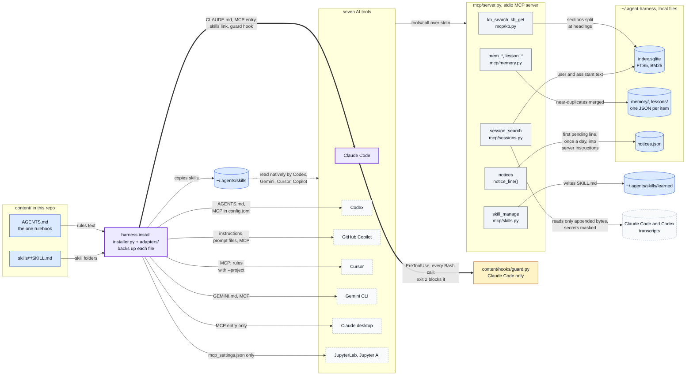
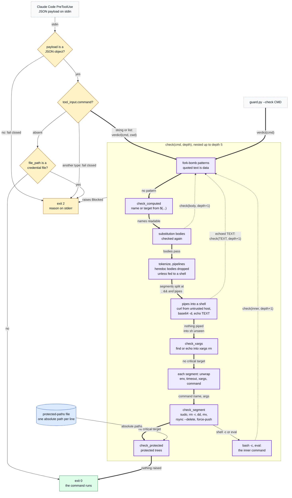
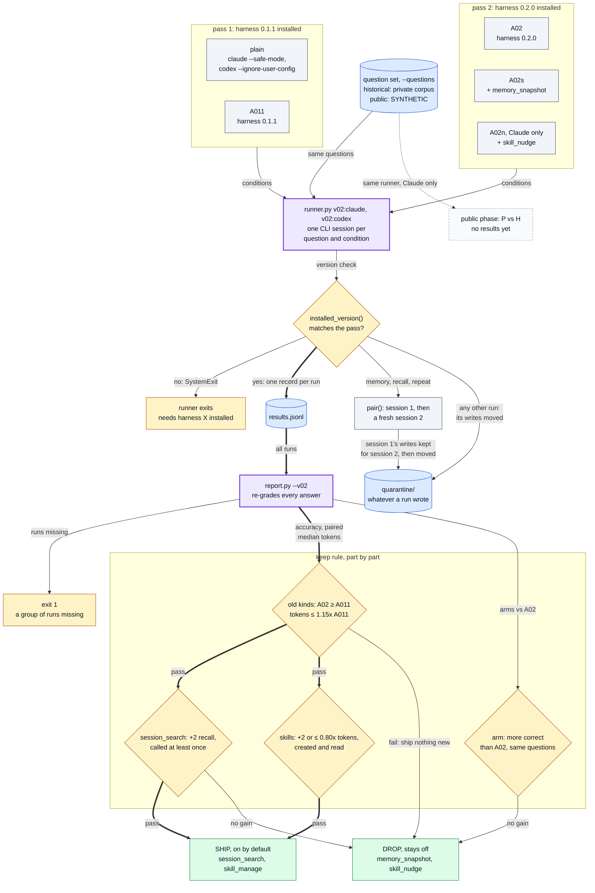

# agent-harness: Shared Rules, Memory, a Work Graph and a Command Guard for AI Coding Agents

[](https://github.com/oscar-chw/agent-harness/actions/workflows/ci.yml) [](https://github.com/oscar-chw/agent-harness/actions/workflows/lint.yml)

**One standard-library install that gives Claude Code shared rules, memory, retrieval, lessons and a command guard, and gives
six other AI coding tools the rules, the memory tools or both, as far as each supports them ([which tool gets what](docs/how-it-works.md#supported-tools)).
Since v0.3 it also carries a work graph: multi-step work as one markdown file per goal, where a step is done only
when its gate command exits 0, run by the graph rather than reported by the model.**

What one install writes into each tool, and what the tools then call (all diagrams: [docs/DIAGRAMS.md](docs/DIAGRAMS.md)):



Where in the code: `src/agent_harness/installer.py`, `src/agent_harness/adapters/*.py`, `src/agent_harness/mcp/`
(`server.py`, `kb.py`, `memory.py`, `sessions.py`, `skills.py`), `content/hooks/guard.py`.

```console
$ harness --home $DEMO_HOME install --dry-run --tools claude-code
Claude Code:
  write $DEMO_HOME/.claude/CLAUDE.md - agent rules (replaces the file)
  merge into $DEMO_HOME/.claude/settings.json - adds a dangerous-command guard and a run-the-checks reminder; your hooks stay
  merge into $DEMO_HOME/.claude.json - registers the harness MCP server (harness)
  ...
Dry run: nothing was written.

$ harness --home $DEMO_HOME install --yes --tools claude-code && harness --home $DEMO_HOME doctor
[ok] python 3.9.6
[ok] SQLite FTS5 available
[ok] claude-code: $DEMO_HOME/.claude/CLAUDE.md
  ...
[ok] MCP server answers tools/list within 5 s (14 tools)
[ok] disk footprint 0.5 MB (cap 20 MB)

$ python3 content/hooks/guard.py --check "rm -rf ~"
agent-harness guard blocked this: rm -r on ~ (the home directory). If it is really intended, ask the human to run it themselves.
exit 2

$ python3 content/hooks/guard.py --check "git status && pytest -q"
exit 0
```

Output of `bash scripts/demo.sh` (2026-10-06, v0.3, macOS, Python 3.9) with the per-file lines cut to `...`. It installs
into a throwaway home, printed as `$DEMO_HOME`, never into yours.

**Quick start** (Python 3.9+, nothing else; `--dry-run` writes nothing):

```sh
git clone https://github.com/oscar-chw/agent-harness.git && cd agent-harness
python3 bin/harness install --dry-run     # every file it would change, for each tool you have
bash scripts/demo.sh                      # install, doctor and the guard, in a throwaway home
```

A real install (without `--dry-run`) **replaces `~/.claude/CLAUDE.md`** and the other tools' instruction files
with the harness rules, and merges into their settings. Every file is backed up first, and `harness uninstall`
restores them all.

| evidence | result | qualifier and source |
|---|---|---|
| Recall of an earlier session, harness v0.1.1 → v0.2.0 (same account setup; v0.2.0 adds `session_search`) | **Claude 1/3 → 3/3, Codex 0/3 → 3/3** | historical, **private corpus**, one run per question, n=3 per tool; significance tests in [Results](#results). Plain's 0/3 is a floor: it cannot read past sessions. [eval/results/historical.md](eval/results/historical.md) |
| Command guard (Claude Code), held out | **39/45 dangerous commands blocked (87%), 20/20 safe controls allowed**, with the guard as it was before the set existed; 40/45 (89%) after one fix made with the set in view | written by the same build session (2026-10-03, after reading the first review), not from the corpus it was fixed against (in-sample: 105/105, 108/108). [tests/test_guard_heldout.py](tests/test_guard_heldout.py) |
| Command guard (Claude Code), against a second corpus written for a different guard | **150/231 → 221/221** dangerous blocked; this repo's own corpus **165/186 → 183/186** | v0.3. The corpus came from agentic-os's bash guard and had never been run against this one, so the first number is held-out; the second is after fixing with it in view. Ten of its cases encode that author's stricter personal policy and are listed, with reasons, in [tests/test_guard_cross.py](tests/test_guard_cross.py) |
| Work graph (v0.3, from agentic-os) | **181 of 203 real nodes gated** across ten graphs; adversarially certified: 29 agents, 21 findings, 20 confirmed, all closed | the author's own use, **not an A/B eval**: so under the keep rule the `plan` tool ships **off** (`HARNESS_ENABLE=plan`). Its own suites came with it: [tests/workgraph](tests/workgraph) |
| Tests, Python 3.9 | **811 passed**, 2 skipped, 2 expected failures (the two relative targets a `--check` call cannot resolve) | `python3 -m pytest -q tests eval`. v0.2 on 3.11 was 271 passed, 1 skipped; v0.3 was not re-run on 3.11 here, CI runs 3.9 and 3.12 |

Provenance: the learning loop (`session_search`, `skill_manage`, the memory snapshot arm) follows the design of
Hermes Agent; skills use the agentskills.io format; the tools talk to the harness over the Model Context Protocol.

Implemented with AI coding agents under Oscar's design and review.

## The problem

AI coding tools such as Claude Code, Codex, GitHub Copilot, Cursor and Gemini CLI are only as good as the
instructions and context they are given. Each has its own instruction file and settings, and no memory shared
with the others. They forget everything between sessions, re-read whole files, claim work is done without
checking it, and repeat the same mistakes. Setting up seven tools by hand, and keeping them consistent, is
tedious and rarely kept up.

agent-harness installs one set of working rules, one shared memory, a searchable knowledge base and a few skills
into every tool it finds, as far as each tool supports them, in each tool's own format, with a backup and an
uninstall; the safety guard goes into Claude Code only.

## Approach (methods and algorithms)

- **One source of truth, many adapters.** An adapter per tool writes `content/AGENTS.md` where that tool reads
  its instructions, registers the MCP server (and, for Claude Code, the guard hook), and records what it wrote for the uninstall.
- **Partial retrieval.** Documents are split into sections at their headings and indexed in SQLite FTS5 with
  BM25 ranking (a pure-Python fallback exists). The rules carry a compact index of section ids; the agent calls
  `kb_get(id)` for one section and `kb_search(query)` only when nothing in the index fits.
- **Memory, lessons, task state, learned skills.** Small files in `~/.agent-harness`, one store per machine
  shared by every tool; near-duplicates merged, caps archive the least used. `skill_manage` saves a procedure
  as `SKILL.md`; `state_save` / `state_load` carry unfinished work across a compaction.
- **Past conversations.** `session_search` indexes your own Claude Code and Codex transcripts incrementally,
  user and assistant messages only, secrets masked before storage, capped at 64 MB.
- **The guard** (`content/hooks/guard.py`) analyses a command rather than pattern-matching its text: it
  tokenises like a shell, splits pipelines, unwraps `env`/`timeout`/`xargs`/`command`, follows `bash -c`,
  `eval`, `$(...)` and heredocs that feed a shell, resolves a relative path against a `cd` earlier on the same
  line, classifies each target (root, home, a top-level home folder, a variable that may be empty, `..`), and
  fails closed on a payload it cannot parse. Standard library only, no subprocesses.
- **The work graph** (`src/agent_harness/workgraph`, v0.3): one markdown file per goal, `- [ ] 3. title |
  needs: 1,2 | gate: <command>`. A node is done only when its gate exits 0, run by the graph; a failed gate
  appends its output and returns the node to pending, so there is no failed state to get stuck in. Claims are
  atomic with a lease, so parallel sessions never take the same node; a worker that rewrites its own gate
  script, forges an `APPROVED`, or edits the plan file mid-round is caught and the round voided. Every gate
  passes the guard before it runs: the graph runs gates itself, so they never reach the PreToolUse hook.
- **Ship by a keep rule:** accuracy no worse, a measurable gain, token overhead within +15%; parts that fail stay
  off by default. The private eval reports call it pre-set, but no committed record here shows it predates the
  2026-09-30 eval (its thresholds first appear in `eval/report.py` on 2026-10-03).

How the guard decides one command: every check can raise `Blocked`; only a command that passes all of them runs.



Where in the code: `content/hooks/guard.py` (`main`, `verdict_for_payload`, `verdict`, `check`, `check_segment`,
`check_protected`, `protected_roots`); the hook entry is in `src/agent_harness/adapters/claude_code.py`.

## Results

Not everything gained: Claude with the harness used 1.24x plain's tokens in the v0.1.1 eval, two of the seven tools
were measured, and the public synthetic eval has no results yet (below, and [Limits](#limits)).

### The A/B eval (historical, private corpus)

**Measured on a private corpus, 2026; question set not published.** The v0.2 eval, 2026-09-30, **254 runs**
(Claude Code and Codex, one run per question and condition), transcribed in
[eval/results/historical.md](eval/results/historical.md); 20 questions with regex graders, plus 3 recall pairs.

**The conditions differ by more than the harness.** "plain" ran Claude with `--safe-mode` and no MCP servers;
the v0.1.1 and v0.2.0 columns ran the author's normal account setup, other plugins and connectors included
([eval/README.md](eval/README.md), "Conditions"), and Codex plain still carries the rules text. So the plain
column is a floor, not a competitor; the harness's own effect is v0.1.1 against v0.2.0.

How the v0.2 eval is run and decided: two passes, one per installed version, then the keep rule part by part.



Where in the code: `eval/runner.py` (`plan_for`, `v02`, `pair`, `quarantine`, `public`), `eval/report.py`
(`v02_verdict`, `TOK_LIMIT`, `REPEAT_TOK`), `eval/questions/synthetic.json`. The SHIP and DROP outcomes are the 2026-09-30 report's,
transcribed in [eval/results/historical.md](eval/results/historical.md).

| | plain | v0.1.1 | v0.2.0 |
|---|---|---|---|
| Claude, 20 questions correct | 17/20 | 18/20 | 19/20 |
| Codex, 20 questions correct | 17/20 | 18/20 | 19/20 |
| Recall of an earlier session (3 questions), Claude | 0/3 | 1/3 | 3/3 |
| Recall of an earlier session (3 questions), Codex | 0/3 | 0/3 | 3/3 |
| Claude fixed context per request, tokens | 17,365 | 37,173 | 37,668 |
| Codex fixed context per request, tokens | 15,054 | 15,054 | 15,134 |

- **Recall, v0.1.1 → v0.2.0:** n=3 is not significant per tool: Fisher exact two-sided p = 0.40 (Claude) and 0.10
  (Codex). Pooled 1/6 → 6/6 gives p = 0.015, but both tools answered the same 3 questions, so the six results are
  not independent. Suggestive, not established.
- **Accuracy** differences of one or two answers on 20 questions are noise: one run per question, and the same
  v0.1.1 build scored 20/20 in its own eval and 18/20 here.
- **Tokens.** v0.2.0 added 495 tokens per request to Claude's fixed context (37,173 → 37,668), about 22% of the
  2,291-token harness rules; the keep rule's measure, the paired median token ratio against v0.1.1, was 1.04
  (limit 1.15). Most of the gap to plain is the author's other plugins, not the harness, and v0.3 measures it:
  a fresh install adds **8.8 KB, about 2,450 tokens**, per Claude request (rules, every advertised tool
  definition, skill descriptions, server instructions), an upper bound since Claude Code defers tool
  definitions until used. That is about an eighth of the 19,808-token gap and within the keep rule's +15% of
  plain (2,605 tokens); [tests/test_context_budget.py](tests/test_context_budget.py) holds it there, part by part. In the v0.1.1 eval
  the paired median token ratio, harness over plain, was 1.24 for Claude and 0.82 for Codex, down from 1.76
  and 1.82 for v0.1.0 (same file, "accuracy and tokens").
- **Shipped off by the keep rule:** `memory_snapshot` and `skill_nudge` (no gain); `run_checks` and `check_guard`
  (12/12 correct in every arm, 0 tampered tests, 0 false "done": the control never failed).

### The same eval, on a public synthetic set

**No results yet.** [eval/](eval/) holds a public SYNTHETIC question set and a `public` phase: plain Claude
against Claude plus this tree's harness in a throwaway home, neither with your own settings or plugins. The one
attempt (2026-10-03, model `claude-opus-5[1m]` as reported by the CLI) failed at the CLI's login before any
model call: 6 runs, 0 tokens, not retried
([record](eval/results/public-synthetic-2026-10-03-claude-opus-5-1m-not-run.json)).
No rerun is planned: as of 2026-10-05 I am not spending Claude or OpenAI usage on this project's experiments.
The set and the runner stay, so anyone with those tools can run it.

### The command guard

**Held out** (45 dangerous commands, 20 safe controls, written on 2026-10-03 by the same AI build session that
fixed the guard, after it had read the first review and before the cd fix; two entries were replaced after it):
**39/45 blocked (87%)**, 20/20 allowed, with the guard as it was before the set existed. The commit that added
the set (b7e3ab4) also fixed one of its commands, `cd /home && rm -rf *`, so the set is no longer held out for
that one; counting it, 40/45 (89%). The 5 remaining misses (`rsync --delete` into `$HOME/`,
`echo ~ | xargs rm -rf`, `truncate` of a system file, inline Python, inline Perl) were closed in v0.3, with the
set in view, so the held-out figure stays 39/45. Reproduce (prints both rates):
`python3 tests/test_guard_heldout.py --rate`.

**v0.3, a second corpus.** agentic-os, the author's Claude-only harness, had its own bash guard and 426 cases
written against it. Each corpus was scored as the other guard's held-out set before either changed: the bash
guard caught 168/186 of this repo's dangerous commands, this guard 150/231 of agentic-os's. Neither dominated:
the bash guard missed interpreter wrapping (`bash <(...)`, a literal `eval`), this one missed tampering with the
guard itself, persistence, credential reads, deletion through an interpreter and computed targets. After
merging: 221/221 and 183/186, with every safe control in both corpora allowed except agentic-os's `sudo` cases,
which this guard blocks by design. The union is kept in [tests/test_guard_cross.py](tests/test_guard_cross.py). **In-sample** ([tests/test_guard_cases.py](tests/test_guard_cases.py),
the set the guard was fixed against): 105/105 blocked, 108/108 allowed, which measures fit. It includes 19 commands two
reviews found, such as `cd ~ && rm -rf *`, `command -p rm -rf ~`,
`bash <(echo 'rm -rf ~')` and `git push --mirror`; a separate list of 21 former bypasses is all blocked too. Details and the
disagreement table: [docs/how-it-works.md](docs/how-it-works.md#the-guard-against-a-wider-corpus-and-a-held-out-set).

## How to run

Python 3.9 or newer, standard library only, under 20 MB. `harness` below is `python3 bin/harness`, or the
`harness` command after `pipx install .` or `uvx --from . harness`.

| command | what it does |
|---|---|
| `harness install --dry-run` | show the plan, change nothing |
| `harness install` | install for every tool found; asks first, backs up every file it changes |
| `harness install --tools claude-code,codex` | only these tools |
| `harness install --project .` | set up only the current project, not your user account |
| `harness status` / `harness doctor` | what is installed, and is it healthy |
| `harness update` | refresh the rules and skills; memory and lessons are kept |
| `harness uninstall` | restore every changed file from its backup and remove what was added |

Memory and lessons stay in `~/.agent-harness` after an uninstall; delete that folder to remove them too.

```sh
bash scripts/demo.sh           # about a second; prints DEMO: PASS
bash scripts/check.sh          # tests, secret scan and the demo; needs pytest; prints CHECK: PASS
```

The eval: [eval/README.md](eval/README.md). The CI workflow (`.github/workflows/ci.yml`) runs the tests, the
secret scan and the demo on Python 3.9 and 3.12 for every push to main; its current status is the CI badge at the top of this README.

## Architecture

The system overview is the first diagram in this README; all four, numbered and each with the code it
is drawn from: [docs/DIAGRAMS.md](docs/DIAGRAMS.md).

| path | role |
|---|---|
| `src/agent_harness/cli.py`, `installer.py`, `adapters/` | install, update, uninstall, doctor; one adapter per tool |
| `src/agent_harness/mcp/` | the MCP server: retrieval, memory, state, sessions, skills, checks |
| `src/agent_harness/workgraph/` | the work graph (v0.3): the `plan` engine, the substance gate for analyse/research/plan, the `plan` MCP tool |
| `content/` | the rules, skills, prompts and hooks that get installed |
| `eval/` | the A/B eval: runner, report generator, SYNTHETIC questions and corpus |
| `tests/` | the harness's tests, the guard corpus and the held-out guard set |

In more depth, including the supported-tools matrix and privacy: [docs/how-it-works.md](docs/how-it-works.md);
the build contract: [CONTRACT.md](CONTRACT.md).

### Design decisions and trade-offs

- **Standard library only.** It must install wherever an AI tool runs, including a remote server over SSH
  where `pip` may be unwanted, so it needs only `python3`. The cost: a pure-Python BM25 when SQLite lacks FTS5,
  and hand-written code for frontmatter and Codex's `config.toml` instead of a YAML or TOML library.
- **A guard that fails closed.** A hook payload the guard cannot parse (not JSON, or a command that is not a
  string) is blocked, not waved through: an agent that hits a false block can ask the human, while a missed
  `rm -rf ~` cannot be undone. The cost is false positives (all `sudo`, fork-bomb text inside a quoted note),
  and it is a seat belt, not a sandbox: 2 known gaps are pinned in the tests (v0.2 had 16 and 5 held-out misses).
- **Gates are judged too.** The work graph runs each gate as a shell command itself, so a gate never reaches
  the PreToolUse hook. Every gate goes through the same guard first; a refused gate is never run and is
  recorded as a failed attempt. With no guard to be found, gates are refused, not run unguarded
  (`PLAN_GUARD=off` is the named opt-out). The cost is that a legitimately destructive gate needs a human.
- **One rules file for every tool that takes one.** Each adapter translates `content/AGENTS.md`, so the tools cannot drift
  apart and a fix lands everywhere at once. The rules are paid for in every request, so a test caps them at 60
  lines; longer guidance lives in skills. The cost is a lowest common denominator: tool-specific features go
  through the adapters.
- **Measured, and not adopted.** Four candidates failed the keep rule and ship off by default (Results).

### History

This harness replaces earlier one-tool setups:
[claude-setup](https://github.com/Oscar-Codespace/claude-setup) and
[copilot-setup](https://github.com/Oscar-Codespace/copilot-setup) (both started April 2026, now
archived), then codex-setup (May 2026), agentic-os (July 2026) and claude-control (July 2026),
which are private. Each configured one tool; agent-harness installs one set of rules, memory and
checks for seven. v0.3 (October 2026) merges in agentic-os's work graph and its guard corpus, so the
enforcement it built for one tool is available, behind the keep rule, to all seven. Drawn as a diagram:
[docs/DIAGRAMS.md, 4](docs/DIAGRAMS.md#4-history-one-tool-setups-to-agent-harness).

## Limits

- **Private corpus, small n.** The A/B results cannot be reproduced from this repository; the public synthetic
  set has no results yet. Recall rests on 3 questions with one run each, which cannot support significance.
- **Confounded baseline.** Plain ran in `--safe-mode`; the harness columns ran the author's full account setup.
  Only v0.1.1 against v0.2.0 isolates the harness, and the repo does not compare against Claude Code's own
  `CLAUDE.md` memory, `--resume`, or a plain grep over past transcripts.
- **Two of the seven tools were measured;** the other adapters are tested for the files they write only.
- **The guard is a seat belt, not a sandbox.** v0.3 closed the computed-target, inline-interpreter,
  persistence and `xargs` gaps. Still open: a glob after `cd` into a folder named by a variable (`cd $DIR && rm -rf
  *` is judged as written), and a relative target in a `--check` call, which has no working directory to resolve
  it against (a real hook payload does). `sudo` is blocked outright.
- **The work graph is not A/B evaluated.** Its evidence is the author's own use (181 of 203 nodes) and an
  adversarial certification, not a gain measured against plain, so the `plan` tool ships off. `plan run`
  dispatches Claude Code workers only; in the other tools the graph is driven one node at a time.
- **`--home DIR` and `HOME=DIR` differ:** only `HOME=DIR` installs VS Code extensions (a download) into the folder.
- **Packaging was checked offline only:** the wheel was built and installed with Python 3.11 (setuptools 83) by
  `pip install --no-index --no-deps --no-build-isolation --target DIR .`; it needs setuptools>=61 (macOS's
  stock Python 3.9 with setuptools 58 installs an empty `UNKNOWN-0.0.0` that way). `pipx` and `uvx` were not available.

## What I learned

Each lesson is drawn from a conclusion an eval record states, with its source; all five confirmed by Oscar on 2026-10-03,
with their evidence claims tightened to the sources on 2026-10-05.

1. **Set the keep rule before the eval, and let it decide.** It shipped `session_search` (recall 6/6 against 1/6 and 0/6) and learned skills,
   and kept the two arms off because they showed no gain. The reports call the rule pre-set; no committed record
   here shows it predates the eval (source: [eval/results/historical.md](eval/results/historical.md), "Decisions
   the report made with its keep rule").

2. **At n=3 a gain can be indistinguishable from noise.** Claude's second runs spread 0.56x to 1.91x with no skill
   involved, and creating a skill costs the first run (Codex: 1.73M tokens against 1.34M)
   (source: [eval/results/historical.md](eval/results/historical.md), the `skill_manage` entry).

3. **A harness's overhead is mostly what it puts in every request.** The v0.1.0 rules cost 4,925 tokens per
   request and the lean v0.1.1 rules 2,291 (-53%). In the v0.1.1 eval Codex went from 1.82x plain's tokens to
   0.82x and Claude from 1.76x to 1.24x; accuracy moved by no more than the noise of one run per question
   (source: [eval/results/historical.md](eval/results/historical.md),
   "v0.1.1 eval ... accuracy and tokens").

4. **A check that guards against a failure shows a gain only when the control fails.** Claude did not tamper with
   or falsely claim "done" on any of 12 control runs, so the two check arms could not be judged
   (source: [eval/results/historical.md](eval/results/historical.md), "v0.1.1 eval ... the check arms").

5. **Check that a run reached the model before grading it.** With the CLI's login expired, six runs each
   "succeeded" in about a second with 0 tokens, and the runner graded all six as wrong answers instead of
   stopping; it now stops at the first run that cannot authenticate (source:
   [eval/results/public-synthetic-2026-10-03-claude-opus-5-1m-not-run.json](eval/results/public-synthetic-2026-10-03-claude-opus-5-1m-not-run.json)).
