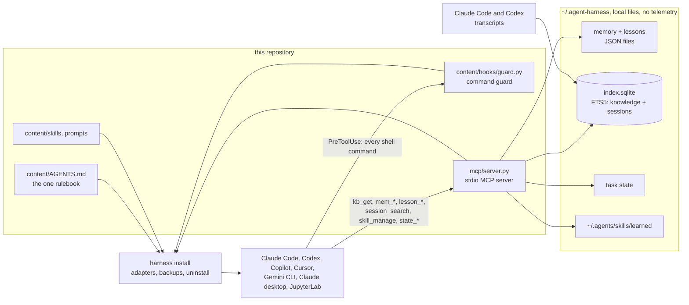

# agent-harness

**One standard-library install that gives seven AI coding tools the same rules, memory, retrieval, lessons and command guard.**

```console
$ harness --home $DEMO_HOME install --dry-run --tools claude-code
Claude Code:
  write $DEMO_HOME/.claude/CLAUDE.md - agent rules (replaces the file)
  merge into $DEMO_HOME/.claude/settings.json - adds a dangerous-command guard and a run-the-checks reminder; your hooks stay
  merge into $DEMO_HOME/.claude.json - registers the harness MCP server (harness)
  ...
Dry run: nothing was written.

$ harness --home $DEMO_HOME install --yes --tools claude-code && harness --home $DEMO_HOME doctor
[ok] python 3.9.6
[ok] SQLite FTS5 available
[ok] claude-code: $DEMO_HOME/.claude/CLAUDE.md
  ...
[ok] MCP server answers tools/list within 5 s (14 tools)
[ok] disk footprint 0.4 MB (cap 20 MB)

$ python3 content/hooks/guard.py --check "rm -rf ~"
agent-harness guard blocked this: rm -r on ~ (the home directory). If it is really intended, ask the human to run it themselves.
exit 2

$ python3 content/hooks/guard.py --check "git status && pytest -q"
exit 0
```

Output of `bash scripts/demo.sh` (2026-10-03, macOS, Python 3.9) with the per-file lines cut to `...`. It installs
into a throwaway home, printed as `$DEMO_HOME`, never into yours.

**Quick start** (Python 3.9+, nothing else; `--dry-run` writes nothing):

```sh
git clone https://github.com/hihihhi/agent-harness.git && cd agent-harness
python3 bin/harness install --dry-run     # every file it would change, for each tool you have
bash scripts/demo.sh                      # install, doctor and the guard, in a throwaway home
```

A real install (without `--dry-run`) **replaces `~/.claude/CLAUDE.md`** and the other tools' instruction files
with the harness rules, and merges into their settings. Every file is backed up first, and `harness uninstall`
restores them all.

| evidence | result | qualifier and source |
|---|---|---|
| Recall of an earlier session, harness v0.1.1 → v0.2.0 (same account setup; v0.2.0 adds `session_search`) | **Claude 1/3 → 3/3, Codex 0/3 → 3/3** | historical, **private corpus**, one run per question. n=3 is not significant per tool (Fisher exact p = 0.40, 0.10; pooled 1/6 → 6/6, p = 0.015). Plain's 0/3 is a floor: it cannot read past sessions. [eval/results/historical.md](eval/results/historical.md) |
| Command guard, held out | **40/45 dangerous commands blocked (89%), 20/20 safe controls allowed** | written fresh, not from the corpus it was fixed against (in-sample: 99/99, 104/104). [tests/test_guard_heldout.py](tests/test_guard_heldout.py) |
| Tests | **270 passed**, 2 skipped, 21 expected failures (pinned guard gaps and held-out misses) | `python3 -m pytest -q tests eval` |

Not everything gained: Claude with the harness used 1.24x plain's tokens in the v0.1.1 eval, two of the seven tools
were measured, and the public synthetic eval has no results yet ([Results](#results), [Limits](#limits)).

Provenance: implemented with AI coding agents under Oscar's design and review. The learning loop (`session_search`,
`skill_manage`, the memory snapshot arm) follows the design of Hermes Agent; skills use the agentskills.io
format; the tools talk to the harness over the Model Context Protocol.

## The problem

AI coding tools such as Claude Code, Codex, GitHub Copilot, Cursor and Gemini CLI are only as good as the
instructions and context they are given. Each has its own instruction file and settings, and no memory shared
with the others. They forget everything between sessions, re-read whole files, claim work is done without
checking it, and repeat the same mistakes. Setting up seven tools by hand, and keeping them consistent, is
tedious and rarely kept up.

agent-harness installs one set of working rules, one shared memory, a searchable knowledge base, a safety
guard and a few skills into every tool it finds, in each tool's own format, with a backup and an uninstall.

## Approach (methods and algorithms)

- **One source of truth, many adapters.** An adapter per tool writes `content/AGENTS.md` where that tool reads
  its instructions, registers the MCP server and the guard hook, and records what it wrote for the uninstall.
- **Partial retrieval.** Documents are split into sections at their headings and indexed in SQLite FTS5 with
  BM25 ranking (a pure-Python fallback exists). The rules carry a compact index of section ids; the agent calls
  `kb_get(id)` for one section and `kb_search(query)` only when nothing in the index fits.
- **Memory, lessons, task state, learned skills.** Small files in `~/.agent-harness`, one store per machine
  shared by every tool; near-duplicates merged, caps archive the least used. `skill_manage` saves a procedure
  as `SKILL.md`; `state_save` / `state_load` carry unfinished work across a compaction.
- **Past conversations.** `session_search` indexes your own Claude Code and Codex transcripts incrementally,
  user and assistant messages only, secrets masked before storage, capped at 64 MB.
- **The guard** (`content/hooks/guard.py`) analyses a command rather than pattern-matching its text: it
  tokenises like a shell, splits pipelines, unwraps `env`/`timeout`/`xargs`/`command`, follows `bash -c`,
  `eval`, `$(...)` and heredocs that feed a shell, resolves a relative path against a `cd` earlier on the same
  line, classifies each target (root, home, a top-level home folder, a variable that may be empty, `..`), and
  fails closed on a payload it cannot parse. Standard library only, no subprocesses.
- **Ship by a pre-set keep rule:** accuracy no worse, a measurable gain, token overhead within +15%, written
  before the eval; parts that fail stay off by default.

## Results

### The A/B eval (historical, private corpus)

**Measured on a private corpus, 2026; question set not published.** The v0.2 eval, 2026-09-30, **254 runs**
(Claude Code and Codex, one run per question and condition), transcribed in
[eval/results/historical.md](eval/results/historical.md); 20 questions with regex graders, plus 3 recall pairs.

**The conditions differ by more than the harness.** "plain" ran Claude with `--safe-mode` and no MCP servers;
the v0.1.1 and v0.2.0 columns ran the author's normal account setup, other plugins and connectors included
([eval/README.md](eval/README.md), "Conditions"), and Codex plain still carries the rules text. So the plain
column is a floor, not a competitor; the harness's own effect is v0.1.1 against v0.2.0.

| | plain | v0.1.1 | v0.2.0 |
|---|---|---|---|
| Claude, 20 questions correct | 17/20 | 18/20 | 19/20 |
| Codex, 20 questions correct | 17/20 | 18/20 | 19/20 |
| Recall of an earlier session (3 questions), Claude | 0/3 | 1/3 | 3/3 |
| Recall of an earlier session (3 questions), Codex | 0/3 | 0/3 | 3/3 |
| Claude fixed context per request, tokens | 17,365 | 37,173 | 37,668 |
| Codex fixed context per request, tokens | 15,054 | 15,054 | 15,134 |

- **Recall, v0.1.1 → v0.2.0:** Fisher exact two-sided p = 0.40 (Claude) and 0.10 (Codex); pooled 1/6 → 6/6,
  p = 0.015, though both tools answered the same 3 questions. Suggestive, not established.
- **Accuracy** differences of one or two answers on 20 questions are noise: one run per question, and the same
  v0.1.1 build scored 20/20 in its own eval and 18/20 here.
- **Tokens.** The harness's share of Claude's fixed context grew +2.5% from v0.1.1 to v0.2.0; most of the gap to
  plain is the author's other plugins (the harness rules alone: 2,291 tokens per request). In the v0.1.1 eval
  the paired median token ratio, harness over plain, was 1.24 for Claude and 0.82 for Codex, down from 1.76
  and 1.82 for v0.1.0 (same file, "accuracy and tokens").
- **Shipped off by the keep rule:** `memory_snapshot` and `skill_nudge` (no gain); `run_checks` and `check_guard`
  (12/12 correct in every arm, 0 tampered tests, 0 false "done": the control never failed).

### The same eval, on a public synthetic set

**No results yet.** [eval/](eval/) holds a public SYNTHETIC question set and a `public` phase: plain Claude
against Claude plus this tree's harness in a throwaway home, neither with your own settings or plugins. The one
attempt (2026-10-03, model `claude-opus-5[1m]` as reported by the CLI) failed at the CLI's login before any
model call: 6 runs, 0 tokens, not retried
([record](eval/results/public-synthetic-2026-10-03-claude-opus-5-1m-not-run.json)).

### The command guard

**Held out** (45 dangerous commands, 20 safe controls, written fresh on 2026-10-03): **40/45 blocked (89%)**,
20/20 allowed; 39/45 before the cd fix. The 5 misses are pinned as expected failures: `rsync --delete` into
`$HOME/`, `echo ~ | xargs rm -rf`, `truncate` of a system file, inline Python, inline Perl. Reproduce:
`python3 tests/test_guard_heldout.py --rate`. **In-sample** ([tests/test_guard_cases.py](tests/test_guard_cases.py),
the set the guard was fixed against): 99/99 blocked, 104/104 allowed, which measures fit. It includes 21 former
bypasses and 13 commands a review found, such as `cd ~ && rm -rf *` and `command -p rm -rf ~`. Details and the
disagreement table: [docs/how-it-works.md](docs/how-it-works.md#the-guard-against-a-wider-corpus-and-a-held-out-set).

## How to run

Python 3.9 or newer, standard library only, under 20 MB. `harness` below is `python3 bin/harness`, or the
`harness` command after `pipx install .` or `uvx --from . harness`.

| command | what it does |
|---|---|
| `harness install --dry-run` | show the plan, change nothing |
| `harness install` | install for every tool found; asks first, backs up every file it changes |
| `harness install --tools claude-code,codex` | only these tools |
| `harness install --project .` | set up only the current project, not your user account |
| `harness status` / `harness doctor` | what is installed, and is it healthy |
| `harness update` | refresh the rules and skills; memory and lessons are kept |
| `harness uninstall` | restore every changed file from its backup and remove what was added |

Memory and lessons stay in `~/.agent-harness` after an uninstall; delete that folder to remove them too.

```sh
bash scripts/demo.sh           # about a second; prints DEMO: PASS
bash scripts/check.sh          # tests, secret scan and the demo; needs pytest; prints CHECK: PASS
```

The eval: [eval/README.md](eval/README.md). The CI workflow (`.github/workflows/ci.yml`) runs the tests, the
secret scan and the demo; it has not run on GitHub yet.

## Architecture



| path | role |
|---|---|
| `src/agent_harness/cli.py`, `installer.py`, `adapters/` | install, update, uninstall, doctor; one adapter per tool |
| `src/agent_harness/mcp/` | the MCP server: retrieval, memory, state, sessions, skills, checks |
| `content/` | the rules, skills, prompts and hooks that get installed |
| `eval/` | the A/B eval: runner, report generator, SYNTHETIC questions and corpus |
| `tests/` | the harness's tests, the guard corpus and the held-out guard set |

In more depth, including the supported-tools matrix and privacy: [docs/how-it-works.md](docs/how-it-works.md);
the build contract: [CONTRACT.md](CONTRACT.md).

### Design decisions and trade-offs

- **Standard library only.** It must install wherever an AI tool runs, including a remote server over SSH
  where `pip` may be unwanted, so it needs only `python3`. The cost: a pure-Python BM25 when SQLite lacks FTS5,
  and hand-written code for frontmatter and Codex's `config.toml` instead of a YAML or TOML library.
- **A guard that fails closed.** A hook payload the guard cannot parse (not JSON, or a command that is not a
  string) is blocked, not waved through: an agent that hits a false block can ask the human, while a missed
  `rm -rf ~` cannot be undone. The cost is false positives (all `sudo`, fork-bomb text inside a quoted note),
  and it is a seat belt, not a sandbox: 16 known gaps and 5 held-out misses are pinned in the tests.
- **One rules file for seven tools.** Each adapter translates `content/AGENTS.md`, so the tools cannot drift
  apart and a fix lands everywhere at once. The rules are paid for in every request, so a test caps them at 60
  lines; longer guidance lives in skills. The cost is a lowest common denominator: tool-specific features go
  through the adapters.
- **Measured, and not adopted.** Four candidates failed the pre-set keep rule and ship off by default (Results).

## Limits

- **Private corpus, small n.** The A/B results cannot be reproduced from this repository; the public synthetic
  set has no results yet. Recall rests on 3 questions with one run each, which cannot support significance.
- **Confounded baseline.** Plain ran in `--safe-mode`; the harness columns ran the author's full account setup.
  Only v0.1.1 against v0.2.0 isolates the harness, and the repo does not compare against Claude Code's own
  `CLAUDE.md` memory, `--resume`, or a plain grep over past transcripts.
- **Two of the seven tools were measured;** the other adapters are tested for the files they write only.
- **The guard is a seat belt, not a sandbox.** Open gaps: targets computed by `$(...)`, inline code in another
  interpreter, login-script and cron persistence, piped input to `xargs`, and a glob after `cd` into a folder
  named by a variable (`cd $DIR && rm -rf *` is judged as written). `sudo` is blocked outright.
- **`--home DIR` and `HOME=DIR` differ:** only `HOME=DIR` installs VS Code extensions (a download) into the folder.
- **Not run in CI yet**, and the packaging was checked offline only: the wheel was built and installed with
  `pip install --no-index --no-deps --no-build-isolation --target DIR .`; `pipx` and `uvx` were not available.

## What I learned

Each lesson is drawn from a conclusion an eval record states, with its source. Lesson 5, from the 2026-10-03
attempt, is still a draft.

1. **Set the keep rule before the eval, and let it decide.** It shipped `session_search` (recall 6/6 against 1/6
   and 0/6) and learned skills, and kept the two arms off because they showed no gain
   (source: [eval/results/historical.md](eval/results/historical.md), "Decisions the report made with its pre-set
   keep rule").

2. **At n=3 a gain can be indistinguishable from noise.** Claude's second runs spread 0.56x to 1.91x with no skill
   involved, and creating a skill costs the first run, so it pays back only from about the third use
   (source: [eval/results/historical.md](eval/results/historical.md), the `skill_manage` entry).

3. **A harness's overhead is mostly what it puts in every request.** The v0.1.0 rules cost 4,925 tokens per
   request and the lean v0.1.1 rules 2,291 (-53%). In the v0.1.1 eval Codex went from 1.82x plain's tokens to
   0.82x, and Claude with the harness from 17 to 19 (batch) and 20 (released build) of 20; the v0.2 eval's
   18/20 for v0.1.1 is a later run of the same build (source: [eval/results/historical.md](eval/results/historical.md),
   "v0.1.1 eval ... accuracy and tokens").

4. **A check that guards against a failure shows a gain only when the control fails.** Claude did not tamper with
   or falsely claim "done" on any of 12 control runs, so the two check arms could not be judged
   (source: [eval/results/historical.md](eval/results/historical.md), "v0.1.1 eval ... the check arms").

5. **Check that a run reached the model before grading it.** With the CLI's login expired, six runs each
   "succeeded" in about a second with 0 tokens, and the runner graded all six as wrong answers instead of
   stopping; it now stops at the first run that cannot authenticate (source:
   [eval/results/public-synthetic-2026-10-03-claude-opus-5-1m-not-run.json](eval/results/public-synthetic-2026-10-03-claude-opus-5-1m-not-run.json)).

   DRAFT — Oscar to confirm
