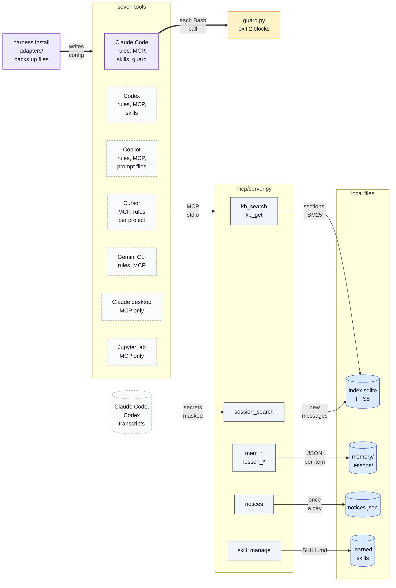
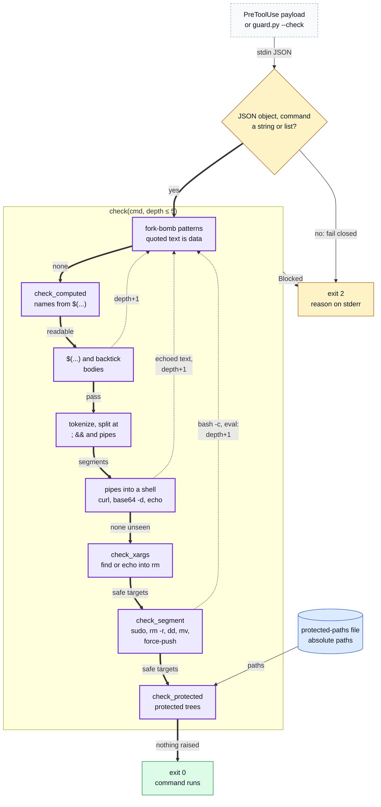
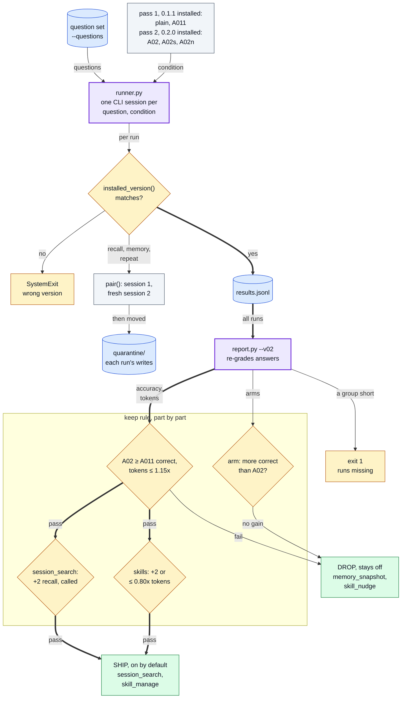
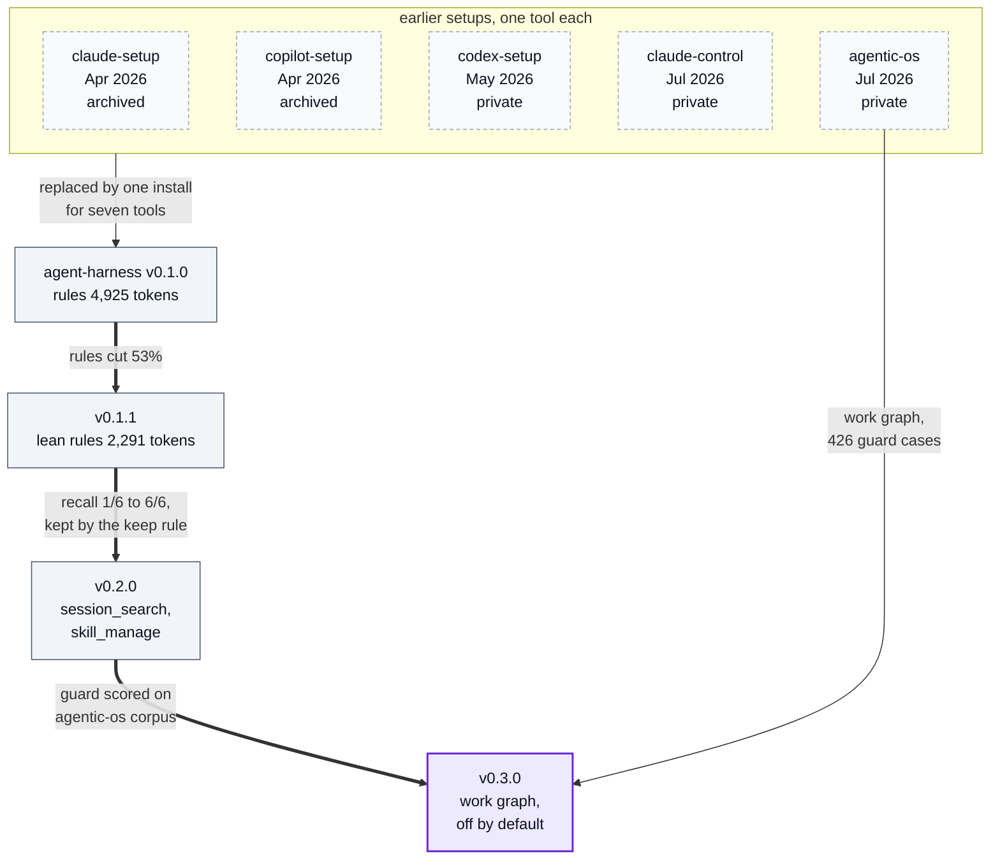

# Diagrams

Numbered index of every diagram for agent-harness. The README embeds 1, 2 and 3; 4 is only here.
If a diagram and the code disagree, the code wins.

1. [System overview](#1-system-overview)
2. [The guard's decision for one command](#2-the-guards-decision-for-one-command)
3. [The A/B eval and its keep rule](#3-the-ab-eval-and-its-keep-rule)
4. [History: one-tool setups to agent-harness](#4-history-one-tool-setups-to-agent-harness)

Colours: blue = inputs and stores, grey = processing, amber = checks and refusals, green = results,
dashed = external or private, purple = the path the diagram is about.

## 1. System overview

What one install writes into each of the seven tools (only Claude Code gets the guard hook), and what the tools
then call on the shared MCP server and its local stores.

Where in the code: `src/agent_harness/installer.py`, `src/agent_harness/adapters/*.py` (skills are copied to
`~/.agents/skills`, which Codex, Gemini CLI, Cursor and Copilot read natively), `src/agent_harness/mcp/`
(`server.py`, `kb.py`, `memory.py`, `sessions.py`, `skills.py`; stores under `~/.agent-harness`, learned skills
under `~/.agents/skills/learned`), `content/hooks/guard.py`.

## 2. The guard's decision for one command

How `guard.py` decides one command: every check can raise `Blocked`; only a command that passes all of them runs.
Substitution bodies, echoed text piped into a shell and `bash -c` / `eval` bodies are checked again, one level deeper.

Where in the code: `content/hooks/guard.py` (`main`, `verdict_for_payload`, `verdict`, `check`, `check_segment`,
`check_protected`, `protected_roots`); the hook entry is in `src/agent_harness/adapters/claude_code.py`.

## 3. The A/B eval and its keep rule

How the v0.2 eval is run and decided: two passes, one per installed version, then the keep rule part by part.
The public phase uses the same runner on the SYNTHETIC set and has no results yet.

Where in the code: `eval/runner.py` (`plan_for`, `v02`, `pair`, `quarantine`, `public`), `eval/report.py`
(`v02_verdict`, `TOK_LIMIT`, `REPEAT_TOK`), `eval/questions/synthetic.json`. The SHIP and DROP outcomes are the 2026-09-30 report's,
transcribed in [eval/results/historical.md](../eval/results/historical.md).

## 4. History: one-tool setups to agent-harness

Which earlier setups agent-harness replaced, and what moved between its tagged versions; the numbers are the
README's (Results, What I learned).

Where in the code: README "History"; the version tags (`git tag`); `content/AGENTS.md` (the rules);
`src/agent_harness/workgraph/`; `tests/guard_corpus_agentic_os.py`, `tests/test_guard_cross.py`.
